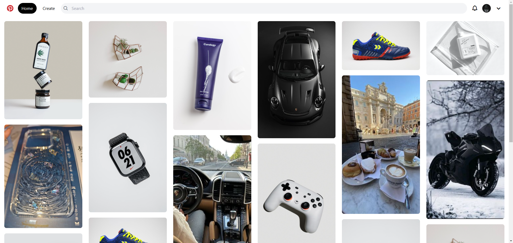
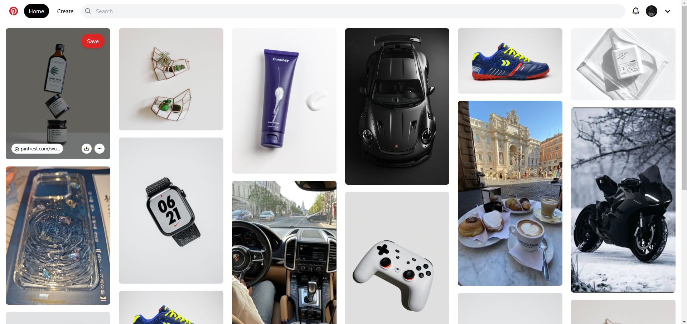
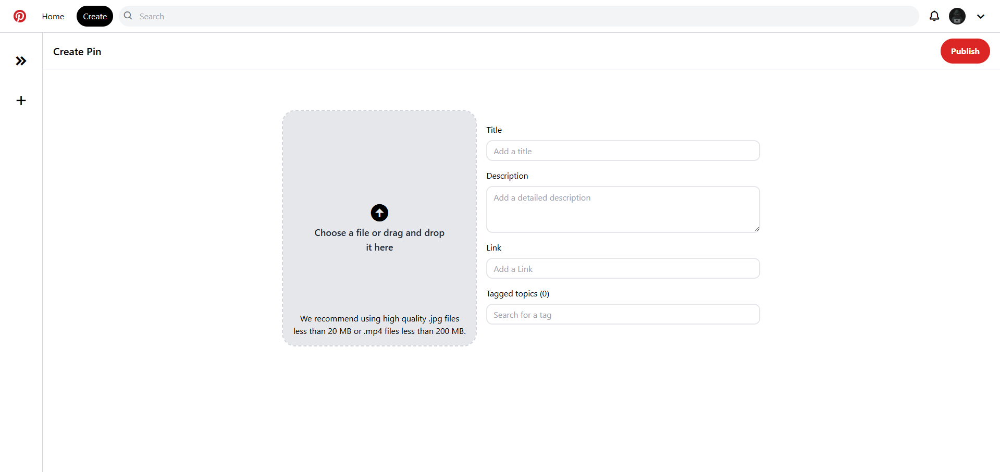

# Pinterest Clone

A Pinterest clone built with React.js.  
This project replicates the core functionalities of Pinterest, allowing users to browse and save pins.

## Features
- **Responsive Design**: Optimized for both desktop and mobile screens.

## Technologies Used
- **Frontend**: React.js, Tailwind CSS

### Image 1: Home Page


### Image 2: Home Page post hover


### Image 3: Create Pin Page


### Prerequisites
Ensure you have the following installed:
- [Node.js](https://nodejs.org/)
- [npm](https://www.npmjs.com/) or [yarn](https://yarnpkg.com/)

### Steps
1. Clone this repository:
   ```bash
   git clone https://github.com/Prog-yassine/pinterest-clone.git
   cd pinterest-clone
